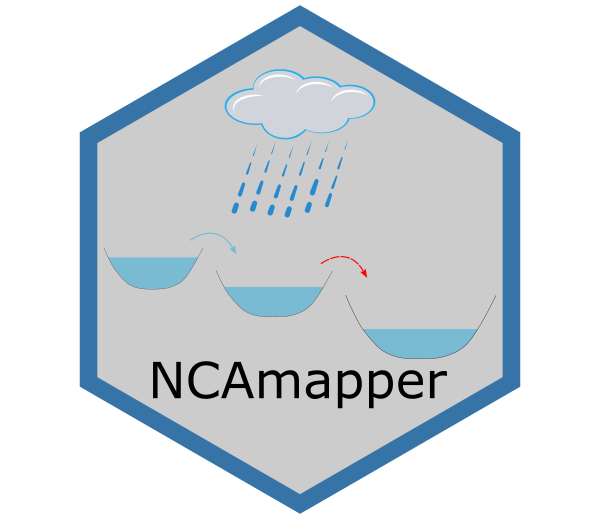

# NCAmapper
A GIS model written in R to map the spatial changes of the Non-Contributing Areas.

_____________
## Abstract

The North American prairie region is characterized by numerous land depressions causing variable non-contributing areas (NCAs) that impact runoff translation into streamflow. Current hydrological models address temporal changes in NCA but neglect spatial distribution and geolocation. The only NCA maps available for the prairies were derived by the Prairie Farm and Rehabilitation Association (PFRA) from paper-based contour maps using subjective interpretation of a 2-year rainfall event. PFRA maps are therefore static and inadequately represent the dynamic nature of NCAs across different return periods. This study introduces NCAmapper, a GIS-based model relying on digital elevation models (DEMs) to map NCAs dynamically for different runoff events in prairie and arctic regions. Evaluation of NCAmapper demonstrates its capabilities in dynamically representing the spatiotemporal variability in NCAs corresponding to different rainfall events. NCAmapper additionally enhances hydrological model parameterization, aiding practitioners in quantifying effective drainage areas and evaluation of flood vulnerability.

____________
## Repo structure

This repo contains the NCAmapper script/model `NCAmapper_script` to map NCAs and spatial water extents.
* main_NCAmapper.R: the main file to run the NCAmapper model. It needs the input directory (inp_dir), which is the working directory that contains the inputs and it is the same directory where outputs will be written.
* functions_NCAmapper.R: a script that contains the used functions/modules by NCAmapper.

The `export_NCAmapper2HDS` directory contains an R script to convert NCAmapper outputs (specifically after the pre-processing step of NCAmapper) to HDS equivalent parameters.

Sample input files for the models are included in the following [Zenodo repository](https://zenodo.org/records/11043366)

## Notes:
1. User has to use uncompressed and projected DEM for the model to work.
2. The shapefiles need to be on the same projected system as the DEM.

## Known issues:
### Fake large NCAs (rarely happen)
Sometimes NCAmapper produces large NCA where there should not be NCA (mainly, where there are observed rivers, check the below figure). This typically happens because:

* the rivers/streams delineated from the DEM (as identified from the flow accumulation raster) are different from the observed rivers.
* there are some depressions on the delineated streams that were not excluded from the analysis (because they are not excluded as no observed river passes through them). If the applied depth is small and the area upstream of those depressions does not contribute much runoff to them, then they may be marked as non-filled and make the area non-contributing.

To fix this, the user should investigate the nonfill depression layer, NCA layer, and flow accumulation to identify where those depressions are (typically at the downstream end of the large fake NCA) and modify the observed rivers to pass through them to be removed (check the below figure).

